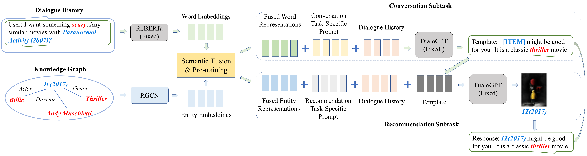

## Chat bot Implementation using UniCRS

This is the official PyTorch implementation for the paper:

> Xiaolei Wang*, Kun Zhou*, Ji-Rong Wen, Wayne Xin Zhao. Towards Unified Conversational Recommender Systems via Knowledge-Enhanced Prompt Learning. KDD 2022.

## Overview

This repository is built on top of the main paper proposed by Xiaolei Wang*, Kun Zhou*, Ji-Rong Wen, Wayne Xin Zhao. Please refer to the github repository link in the acknowledgement section to find out more of their source code. Do note that we credit and appreciate all of the work to the original authors of UniCRS. Without them, it would have been impossible for us to build our working version of the chat bot on telegram. 

This repository was created for the final project of CS608 Recommender Systems at Singapore Management University.

Over here, we have consolidated the training procedure of UniCRS, inference commands for UniCRS as well as the deployment of the Telegram bot on google colab in the following file:
- UniCRS_commandline.ipynb

My team has also attached our final version of the powerpoint slides to compare the effectiveness of 3 main ReDial-based algorithms (HRED, KBRD and UniCRS) based on the ReDial, DBPedia and movielens dataset. More elaboration on our implementation of the chatbot and its efficacy are also included in the slides.

*Do note that our team has run the default settings on all 3 algorithms and it should be noted that we did not do additional finetuning. Thus, for the results included in the slides, it is highly likely that the performance of UniCRS is understated as compared to KBRD's performance. For more information on the best performances of the algorithms on ReDial, please refer to the link: https://paperswithcode.com/sota/recommendation-systems-on-redial 




## Instructions

Refer to the github link in the acknowledgement section for the full code. Follow the instructions stated there and attach the required datasets in their respective folders.

After that, put UniCRS_commandline.ipynb into your root folder and execute the lines included. 

*Do note that for the training, we have used the A100 GPU on google colab pro and it takes roughly 12 hours to train. We do admit that perhaps a more efficient way can be explored in the training process which we have not done. 

*For inference to be done on the chatbot, please attach an env.py (which contains your API_TOKEN given by BotFather in Telegram) in the src folder of the original UniCRS repository.

## Limitations of our chat bot on telegram

Our Telebot implemented is suitable only for one user at current. The conversations are cached and duplicated in both the src/data/redial and src/data/redial_gen folders. Further work could be explored at deploying this chatbot at scale in a distributed manner. 

## For further queries of the implementation of the chatbot

Please email me at wjlim.2022@mitb.smu.edu.sg


## Acknowledgement

1. Full credits on the implementation of UniCRS are given to the authors at https://github.com/RUCAIBox/UniCRS 

Without them, this chatbot would have been impossible to build.


2. Special thanks the CRS toolkit [CRSLab](https://github.com/RUCAIBox/CRSLab), which was used to run experiments of baseline models.

```bibtex
@inproceedings{wang2022towards,
  title={Towards Unified Conversational Recommender Systems via Knowledge-Enhanced Prompt Learning},
  author={Wang, Xiaolei and Zhou, Kun and Wen, Ji-Rong and Zhao, Wayne Xin},
  booktitle={Proceedings of the 28th ACM SIGKDD Conference on Knowledge Discovery and Data Mining},
  pages={1929--1937},
  year={2022}
}
```

3. Special thanks to my project group mates for the assistance and support.
- Chia De Han
- Ng Juan Yong
- Colin Jiang
